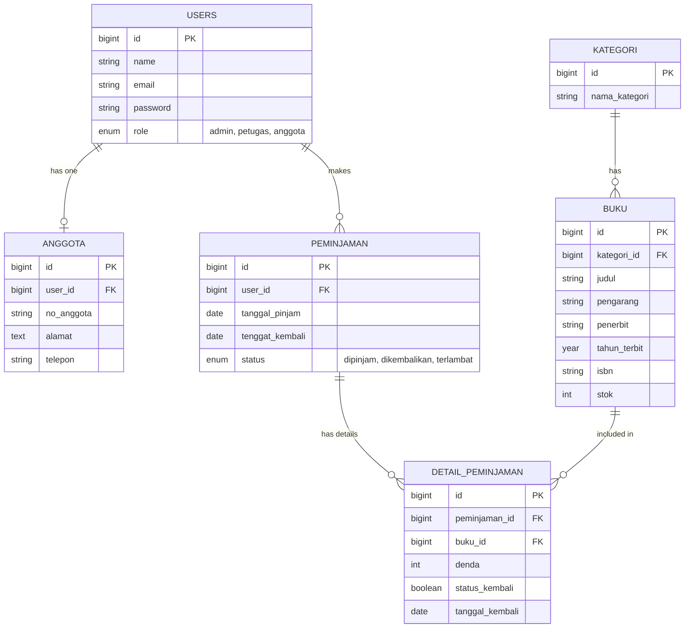

<div align="center">
  <h2>LAPORAN UJIAN AKHIR SEMESTER</h2>
  <h3>Basis Data Lanjut</h3>
  <p><em>Studi Kasus: Sistem Informasi Manajemen Perpustakaan</em></p>
  <br>
  <p><strong>Kelompok:</strong> Perpustakaan</p>
  <p>A. Alfin Muzakky (1412240003)</p>
  <p>Sofia Nur Jihan (1412240084)</p>
</div>

<br>

### 1. Latar Belakang Kebutuhan Fitur
Sistem Informasi Absensi (SIABSEN) yang sebelumnya dikembangkan diadaptasi pada UAS ini menjadi domain Sistem Informasi Manajemen Perpustakaan. Perpustakaan membutuhkan pencatatan peminjaman dan pengembalian buku yang akurat, dengan manajemen stok real-time agar peminjaman tidak melebihi stok yang tersedia. Fitur ini krusial karena rawan terjadi duplikasi peminjaman atau anggota meminjam buku yang belum dikembalikan, sehingga diperlukan validasi berlapis dan penanganan concurrency (race condition).

### 2. Rancangan Solusi
* **Perancangan Basis Data Lanjut (D.1):** tabel users, anggota, kategori, buku, peminjaman, dan detail_peminjaman, dinormalisasi ke 3NF untuk meminimalisir redundansi.
* **Perancangan RESTful API (D.2):** 11 endpoint API baru untuk auth, pengelolaan buku, dan transaksi peminjaman, dengan validasi berlapis (cek user, cek stok, cek duplikasi peminjaman aktif).
* **Validasi Input & SQL Injection:** menggunakan FormRequest Laravel (BukuRequest & PeminjamanRequest).
* **Otorisasi Berbasis Role:** hanya admin/petugas yang dapat melakukan CRUD Buku; anggota hanya dapat meminjam.
* **Indexing:** kolom judul pada tabel buku dan kolom status pada tabel peminjaman diindeks untuk mempercepat pencarian dan filter query.
* **Penanganan Concurrency:** DB::transaction dan lockForUpdate() saat mengambil data buku, mencegah race condition ketika dua user meminjam buku terakhir secara bersamaan.

### 3. Kendala Teknis yang Dihadapi
Kendala mencakup N+1 query yang diselesaikan dengan eager loading (with('kategori') dan with(['user', 'detailPeminjaman.buku'])). Selain itu, multi-step validasi peminjaman agar user tidak dapat meminjam buku yang sama sebelum dikembalikan memerlukan relasi Eloquent yang cukup rumit, diselesaikan dengan query builder pada relasi yang tepat.

### 4. Cara Pengujian yang Dilakukan
Pengujian dilakukan menggunakan Feature Testing bawaan Laravel (PHPUnit/Pest) melalui kelas BukuApiTest dan PeminjamanApiTest, mencakup skenario sukses (GET buku, peminjaman berhasil, pengembalian berhasil) dan skenario gagal (otorisasi gagal saat anggota membuat buku, validasi gagal saat stok habis, pencegahan duplikasi peminjaman buku yang sedang dipinjam).

Perintah untuk menjalankan test:
```bash
php artisan test
```

---

### Diagram ERD (Entity Relationship Diagram)



---

### Dokumentasi API (Endpoint RESTful)

**Base URL:** `/api`  
Semua endpoint (kecuali Login/Register) mewajibkan Header: `Authorization: Bearer <token>`

#### 1. Authentication

| Method | Endpoint | Deskripsi |
| :--- | :--- | :--- |
| **POST** | `/register` | Mendaftarkan user baru (default role anggota). Body: name, email, password, role (opsional). |
| **POST** | `/login` | Otentikasi dan mendapatkan token Sanctum. Body: email, password. |
| **POST** | `/logout` | Revoke token yang sedang digunakan. |

#### 2. Modul Buku

| Method | Endpoint | Deskripsi |
| :--- | :--- | :--- |
| **GET** | `/buku` | Mendapatkan seluruh daftar buku beserta kategori (eager loaded). Dapat diakses semua role. |
| **POST** | `/buku` | Menambahkan buku baru (admin/petugas). Body: kategori_id, judul, pengarang, penerbit, tahun_terbit, isbn, stok. |
| **GET** | `/buku/{id}` | Mendapatkan detail buku tertentu. |
| **PUT** | `/buku/{id}` | Memperbarui data buku (admin/petugas). |
| **DELETE** | `/buku/{id}` | Menghapus data buku (admin/petugas). |

#### 3. Modul Peminjaman
Transaksi database dengan validasi berlapis.

| Method | Endpoint | Deskripsi |
| :--- | :--- | :--- |
| **GET** | `/peminjaman` | Mendapatkan data peminjaman; role anggota hanya melihat riwayat miliknya sendiri. |
| **POST** | `/peminjaman` | Meminjam buku. Body: buku_ids [], tenggat_kembali. |
| **POST** | `/peminjaman/{id}/kembali` | Mengembalikan buku yang dipinjam. Body: buku_ids []. |

**Alur Validasi Berlapis — POST /peminjaman**
* Memastikan ID buku valid.
* Lock record buku (lockForUpdate) untuk mencegah race condition stok.
* Cek stok buku > 0; jika gagal, rollback.
* Cek apakah user sudah meminjam buku tersebut dan belum dikembalikan; jika duplikat, rollback.
* Commit transaksi dan kurangi stok buku.

Contoh body request:
```json
{
 "buku_ids": [1, 2],
 "tenggat_kembali": "2026-07-25"
}
```

**Alur Proses — POST /peminjaman/{id}/kembali**
Validasi otorisasi anggota, memvalidasi buku masih berstatus dipinjam, lalu memperbarui status pengembalian dan menambah kembali stok buku.
